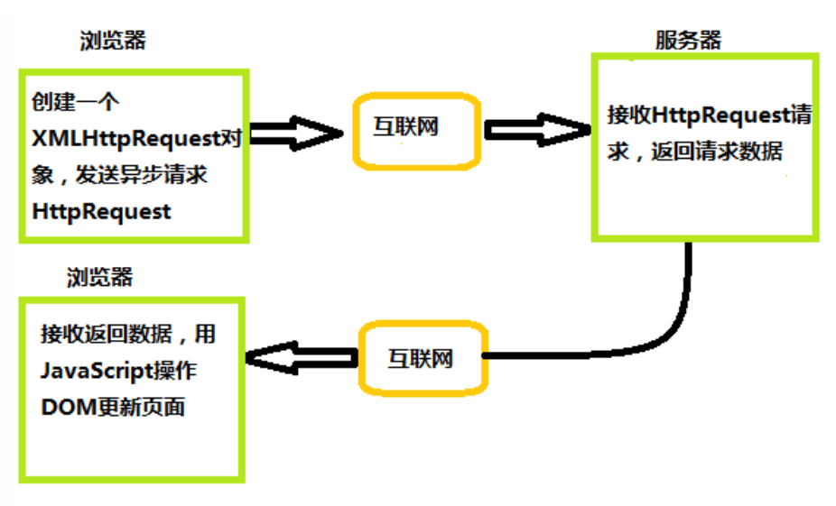

## AJAX是什么

`AJAX` 全称(Async Javascript and XML),异步的 JavaScript 和 XML,可以在不重新加载整个网页的情况下，与服务器交换数据，并且更新部分网页



## 实现过程

- 创建 Ajax 的核心对象 XMLHttpRequest 对象

- 通过 XMLHttpRequest 对象的 open() 方法与服务端建立连接

- 构建请求所需的数据内容，并通过 XMLHttpRequest 对象的 send() 方法发送给服务器端

- 通过 XMLHttpRequest 对象提供的 onreadystatechange 事件监听服务器端的通信状态

- 接受并处理服务端向客户端响应的数据结果

- 将处理结果更新到 HTML 页面中

## 手写

```js

// 手写AJAX
function ajax(options) {
  var method = options.method.toUpperCase() || 'GET';
  var { url, params} = options
  // 参数拼接
  var pair = [];

  for (var k in params) {
    pair.push(k + "=" + params[k]);
  }
  var str = pair.join("&");
  // 判断请求方法
  if (method === "GET") {
    // 字符串拼接 或者 模板字符串
    options.url += "?" + str;
  }

  var data = null;
  if (method === "POST") {
    data = str;
  }


  return new Promise(function (resolve, reject) {
    const xhr = new XMLHttpRequest();
    xhr.open(method, url, false); // xhr.open()方法第三个参数要求传入的是一个boolean值，其作用就是设置此次请求是否采用异步方式执行。
    method === "POST" && xhr.setRequestHeader("Content-type", "application/x-www-form-urlencoded");
    xhr.onreadystatechange = function () {
      // 由于 readystatechange 事件是在 xhr 对象状态变化时触发（不单是在得到响应时），也就意味着这个事件会被触发多次。
      //  0 -代理被创建，但尚未调用 open() 方法。
      // 1 -open() 方法已经被调用。
      // 2 -send() 方法已经被调用，并且头部和状态已经可获得。
      // 3 -下载中， responseText 属性已经包含部分数据。
      // 4 -下载操作已完成
      if (xhr.readyState !== 4) return
      if (xhr.status === 200 && xhr.status < 300 || xhr.status === 304) {
        // 200 正常
        // 3xx
        // 301 永久重定向。如http://xxx.com这个 GET 请求（最后没有/），就会被301到http://xxx.com/（最后是/）
        // 302 临时重定向。临时的，不是永久的
        // 304 资源找到但是不符合请求条件，不会返回任何主体。如发送 GET 请求时，head 中有If-Modified-Since: xxx（要求返回更新时间是xxx时间之后的资源），如果此时服务器 端资源未更新，则会返回304，即不符合要求
        // 404 找不到资源
        // 5xx 服务器端出错了
        resolve(xhr.response)
      } else {
        reject(new Error(xhr.response))
      }
    }
    xhr.send(data)
  })
}

```
