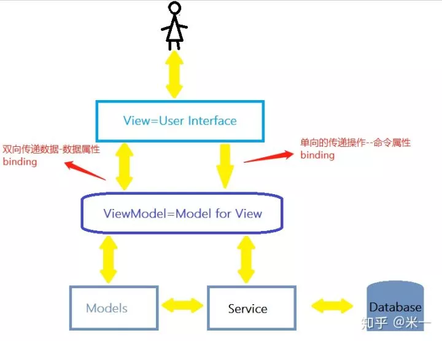

## 一 vue是什么

Vue.js（/vjuː/，或简称为Vue）是一个用于创建用户界面的开源JavaScript框架，也是一个创建单页应用的Web应用框架。2016年一项针对JavaScript的调查表明，Vue有着89%的开发者满意度。在GitHub上，该项目平均每天能收获95颗星，为Github有史以来星标数第3多的项目同时也是一款流行的JavaScript前端框架，旨在更好地组织与简化Web开发。Vue所关注的核心是MVC模式中的视图层，同时，它也能方便地获取数据更新，并通过组件内部特定的方法实现视图与模型的交互PS: Vue作者尤雨溪是在为AngularJS工作之后开发出了这一框架。他声称自己的思路是提取Angular中为自己所喜欢的部分，构建出一款相当轻量的框架最早发布于2014年2月

## 二 vue核心特性

### 数据驱动（MVVM)

MVVM 示的是 Model-View-ViewModel

- Model：模型层，负责处理业务逻辑以及和服务器端进行交互
- View：视图层：负责将数据模型转化为UI展示出来，可以简单的理解为HTML页面
- ViewModel：视图模型层，用来连接Model和View，是Model和View之间的通信桥梁

### 组件化

1. 什么是组件化一句话来说就是把图形、非图形的各种逻辑均抽象为一个统一的概念（组件）来实现开发的模式，在Vue中每一个.vue文件都可以视为一个组件

2. 组件化的优势

   - 降低整个系统的耦合度，在保持接口不变的情况下，我们可以替换不同的组件快速完成需求，例如输入框，可以替换为日历、时间、范围等组件作具体的实现

   - 调试方便，由于整个系统是通过组件组合起来的，在出现问题的时候，可以用排除法直接移除组件，或者根据报错的组件快速定位问题，之所以能够快速定位，是因为每个组件之间低耦合，职责单一，所以逻辑会比分析整个系统要简单

   - 提高可维护性，由于每个组件的职责单一，并且组件在系统中是被复用的，所以对代码进行优化可获得系统的整体升级

### 指令

指令 (Directives) 是带有 v- 前缀的特殊属性作用：当表达式的值改变时，将其产生的连带影响，响应式地作用于 DOM

- 条件渲染指令 v-if
- 列表渲染指令v-for
- 属性绑定指令v-bind
- 事件绑定指令v-on
- 双向数据绑定指令v-model

## 三 与传统开发的区别

- Vue所有的界面事件，都是只去操作数据的，Jquery操作DOM
- Vue所有界面的变动，都是根据数据自动绑定出来的，Jquery操作DOM

## 四 Vue和React对比

相同点

- 都有组件化思想
- 都支持服务器端渲染
- 都有Virtual DOM（虚拟dom）
- 数据驱动视图
- 都有支持native的方案：Vue的weex、React的React native
- 都有自己的构建工具：Vue的vue-cli、React的Create React App

区别

- 数据变化的实现原理不同。react使用的是不可变数据，而Vue使用的是可变的数据
- 组件化通信的不同。react中我们通过使用回调函数来进行通信的，而Vue中子组件向父组件传递消息有两种方式：事件和回调函数
- diff算法不同。react主要使用diff队列保存需要更新哪些DOM，得到patch树，再统一操作批量更新DOM。Vue 使用双向指针，边对比，边更新DO

